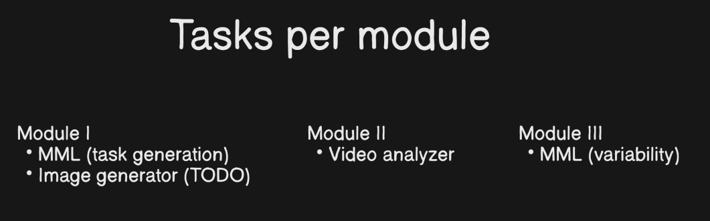
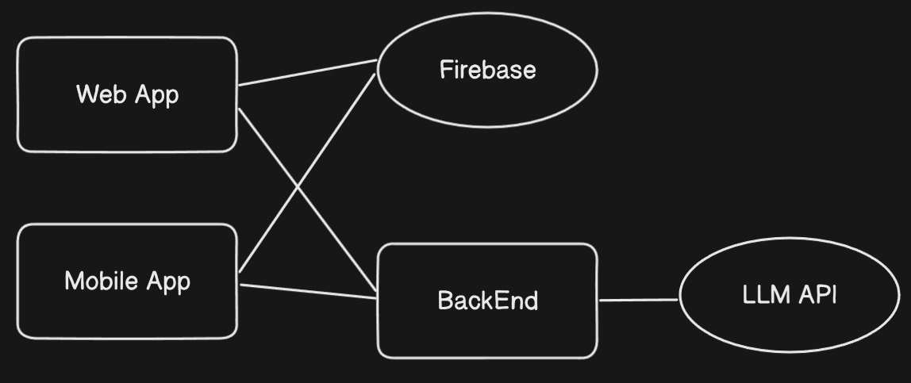

# EmoPuzzleBK - Emotion Detection & Quiz Generation API

FastAPI додаток для аналізу емоцій на відео та генерації тестів на основі тексту.

## 📦 Встановлення

### Локальний запуск
1. Встановіть Python 3.9
2. Клонуйте репозиторій:
   ```bash
   git clone https://github.com/yourusername/EmoPuzzleBK.git
   cd EmoPuzzleBK

3. Встановіть залежності:
   ```bash
   pip install -r requirements.txt
   ```




## 🌐 Доступні ендпоїнти

### 1. Детектор емоцій (WebSocket)
**URL**: `ws://localhost:8000/ws`  
**Метод**: WebSocket  
**Вхідні дані**: 
- Текстова строка з назвою емоції (наприклад "happy")
- Потік байтів зображення з камери

**Вихідні дані**:  
Строка з результатом (наприклад "Знайдено емоцію: happy")

**Клієнтський інтерфейс**:  
Доступний за основним URL (`http://localhost:8000`)


### 2. Генератор тестів (HTTP GET)


**URL**: `/quiz/create_quiz`  
**Параметри**:
- `text`: Текст для аналізу (обов'язковий)
- `lang`: Мова ("UA" або "ENG", за замовчуванням "UA")

**Приклад запиту**:
```bash
curl "http://localhost:8000/quiz/create_quiz?text=Дівчина_посміхається&lang=UA"
```

**Вихідні дані (JSON)**:
```json
{
  "Question": "Як почувається дівчина?",
  "Answer": ["Щаслива", "Сумна", "Зла", "Здивована"],
  "Explanation": "Вона щаслива, тому що посміхається"
}
```

### 3. Перефразування тексту (HTTP GET)
**URL**: `/novel/create_novel`  
**Параметри**:
- `text`: Текст для перефразування
- `lang`: Мова ("UA" або "ENG")

**Приклад**:
```bash
curl "http://localhost:8000/novel/create_novel?text=Original_text&lang=ENG"
```

**Вихідні дані**:
```json
{
  "text": "Paraphrased version of original text"
}
```

## 🛠 Технічні деталі

### Структура проекту
```
app/
├── ai_model/              # Моделі машинного навчання
├── routers/               # Маршрути FastAPI
├── main.py                # Основний файл додатку
├── models.py              # Завантаження ML-моделей
└── myutils.py             # Бізнес-логіка
```
